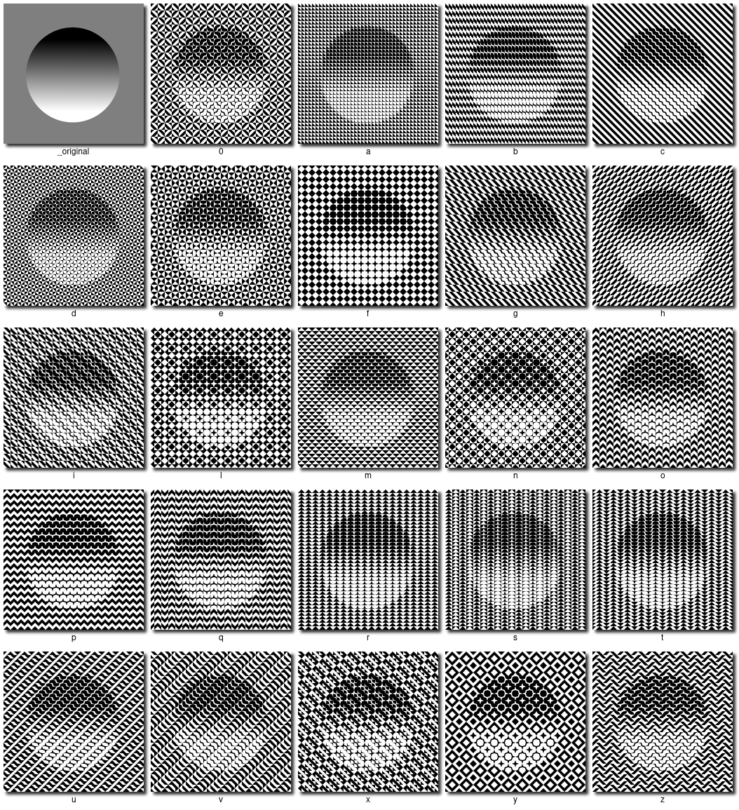

# truchet

A Go program to generate Truchet patterned images from existing pngs.

Usage: `truchet -i inputFile [-o outputFile] [-p pattern] [-t tileSize]`

OutputFile defaults to "out.png"

TileSize defaults to 10

Pattern defaults to "a"

Valid patterns: a, b, c, d, e, f, g, h, i, l, m, n, o, p, q, r, s, t, u, v, x, y, z, 0

Examples (click on image to see full size):

Idea from the book [Opt Art](https://amzn.to/2w9CVVD) by Robert Bosch.

Tile patterns from [The Tiling Patterns of Sebastien Truchet and the Topology of Structural Hierarchy ](https://www.jstor.org/stable/1578535) by Cyril Stanley Smith and Pauline Boucher.
